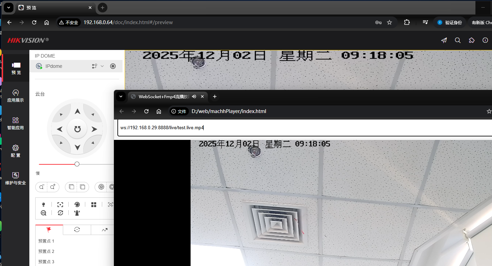

# maPlayer

macPlayer是一个基于WebSocket-fMP4协议的Web视频播放器,其主要目的是在浏览器上实现低延迟（0-3 秒）视频播放，支持H.264和H.265码流，使用mp4box.js解析mp4元数据，
通过HTML5 <video> 标签和 Media Source Extensions (MSE) 实现原生播放。

....

 
## 关键特性

- 低延迟播放：延时1s左右， 通过WebSocket接收fMP4片段，直接追加到MSE的 SourceBuffer中，使用 video.buffered设置currentTime实现从缓存片段的播放。
- 编解码支持：原生H.264/H.265（fMP4 格式）
- 技术栈：WebSocket（流传输）、MSE（媒体追加）、HTML5 Video（渲染）
- 实现了简单的重连/退避机制及内存回收机制，
- 支持H.264/H.265+AAC

## 项目计划
这个项目是我用来熟悉web端音视频播放相关技术方案的入门项目。后期如果能力和时间允许，再尝试WASM，WebGL, WebGPU , WebCodecs,WebTransport等更加牛逼的技术方案.

